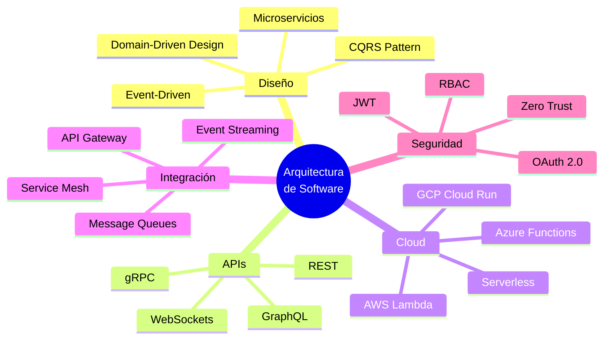
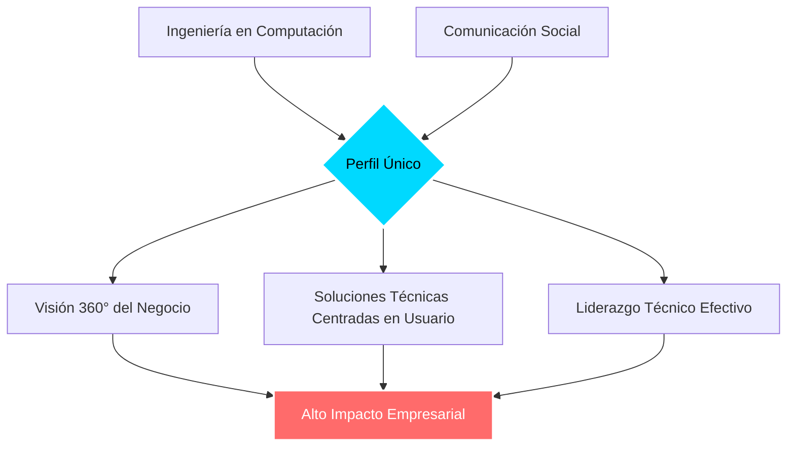
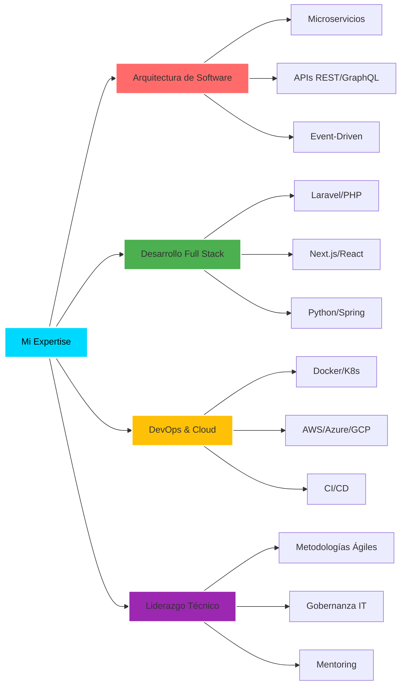
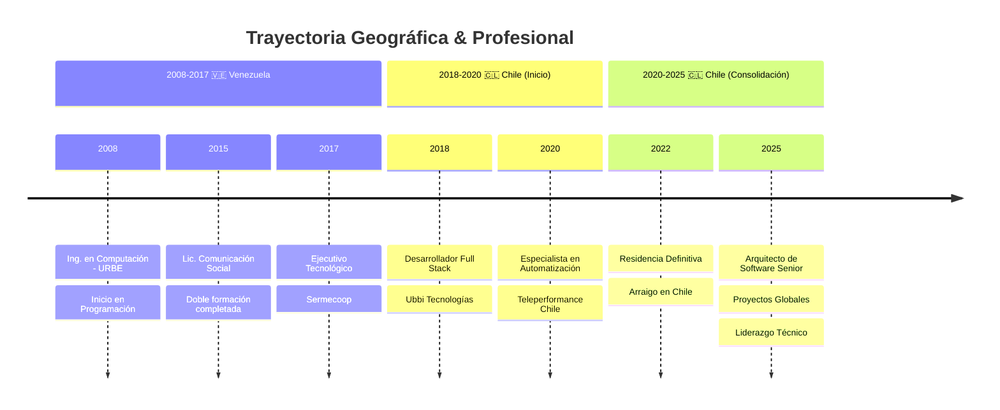

<div align="center">


</div>

<div align="center">

[](https://git.io/typing-svg)

</div>

---

<div align="center">

### 🌟 **Ingeniero en Computación** | **Comunicólogo** | **Full Stack Architect**

```ascii
╔══════════════════════════════════════════════════════════════════════════════╗
║  🎯 Visión: Combinar excelencia técnica con estrategia de negocio           ║
║  ⚡ Misión: Crear soluciones escalables que generen impacto real            ║
║  🚀 Pasión: Automatización, DevOps y Arquitecturas de Alto Rendimiento      ║
╚══════════════════════════════════════════════════════════════════════════════╝
```

</div>

---

## 🎯 Perfil Ejecutivo

<table>
<tr>
<td width="60%">

### 👨‍💻 Sobre Mí

Arquitecto de Software con **8+ años de experiencia** especializado en el diseño de **arquitecturas empresariales escalables**. Mi trayectoria única combina:

🔹 **Ingeniería en Computación** (desde 2008)
🔹 **Comunicación Social** (visión estratégica)
🔹 **Experiencia Internacional** (Venezuela → Chile)

Mi **doble formación** me permite traducir requisitos de negocio en soluciones técnicas robustas, liderando la transformación digital con un enfoque en **automatización, microservicios y DevOps**.

</td>
<td width="40%">

### 📊 Impacto Cuantificable

```yaml
Logros:
  ⚡ Reducción: 15% ↓ tiempos proceso
  💰 Ahorro: 4h/hombre por área
  🌍 Alcance: Nacional & Global
  🏆 Proyectos: 50+ completados
  👥 Equipos: Liderazgo técnico
  📈 Uptime: 99.9% en producción
```

### 🎖️ Especializaciones

- ✅ Arquitectura de Microservicios
- ✅ APIs REST/GraphQL
- ✅ Cloud Architecture (AWS/Azure/GCP)
- ✅ DevOps & CI/CD
- ✅ Automatización Empresarial

</td>
</tr>
</table>

---

## 📫 Conecta Conmigo

<div align="center">

[](mailto:davidbadell42@gmail.com)
[](https://wa.me/56937871331)
[](tel:+56933101623)
[](https://maps.google.com)

[](https://github.com/Devdprivity)
[](#)

</div>

---

## 💼 Trayectoria Profesional

### 🏢 **Teleperformance Chile**
#### 🔹 *Especialista en Reportería y Automatización - Departamento de Training*
**📅 Marzo 2020 - Octubre 2025 | 5+ años**

<details open>
<summary><b>🎯 Responsabilidades & Logros Clave</b></summary>

<br>

**🏗️ Arquitectura & Liderazgo Técnico:**
- 🚀 Diseño e implementación de **arquitecturas de reportería automatizada** a nivel Nacional & Global
- 📐 Aplicación de **principios de gobernanza IT** y mejores prácticas de arquitectura empresarial
- 🔧 Definición de **patrones de integración** para sistemas legacy y nuevas plataformas
- 🎯 Liderazgo técnico en la **transformación digital** del departamento

**⚡ Automatización & Optimización:**
```diff
+ Reducción 15% en tiempos de procesamiento de reportes críticos
+ Ahorro de ~4 horas/hombre por área en tareas manuales
+ Implementación de pipelines CI/CD para deploys automatizados
+ Sistemas de monitoreo y observabilidad en tiempo real
```

**🔐 Seguridad & Operaciones:**
- 🛡️ Implementación de **seguridad tecnológica** y gestión de identidades
- 📊 Desarrollo de **sistemas de observabilidad** para operaciones críticas
- 🔄 Mejora continua mediante **metodologías ágiles** (Scrum/Kanban)
- 🎓 Sistemas automatizados para procesos de entrenamiento y capacitación

**🛠️ Stack Tecnológico Utilizado:**
`PHP` • `Laravel` • `Python` • `Node.js` • `PostgreSQL` • `Docker` • `Redis` • `Git`

</details>

---

### 💻 **Ubbi Tecnologías S.A.**
#### 🔹 *Desarrollador Full Stack Senior*
**📅 2018 - Enero 2020 | 2 años**

<details>
<summary><b>🚀 Proyectos & Contribuciones</b></summary>

<br>

**🏗️ Desarrollo de Soluciones Empresariales:**
- 🎯 Diseño y desarrollo de **aplicaciones web robustas y escalables**
- 🔧 Implementación de **microservicios** y **APIs REST** para clientes corporativos
- 📊 Levantamiento y **modelado de sistemas** complejos
- 🤝 Colaboración en **proyectos de transformación digital**

**📈 Impacto:**
- ✅ 15+ proyectos entregados exitosamente
- ✅ Arquitecturas escalables para startups en crecimiento
- ✅ Soluciones personalizadas para diversos sectores (fintech, e-commerce, servicios)

**🛠️ Tecnologías:**
`Laravel` • `Vue.js` • `React` • `MySQL` • `MongoDB` • `AWS` • `Docker`

</details>

---

### 🌐 **Sermecoop**
#### 🔹 *Ejecutivo Multifuncional - Departamento Tecnológico*
**📅 2017 - 2018 | 1 año**

<details>
<summary><b>💡 Responsabilidades Técnicas</b></summary>

<br>

**🔐 Infraestructura & Seguridad:**
- 🌐 Gestión integral de **redes y plataformas digitales**
- 🔒 Enfoque en **seguridad tecnológica** y protección de datos
- 🖥️ Administración de **infraestructura tecnológica** corporativa
- 📊 Implementación de sistemas de **monitoreo** y alertas

**💼 Desarrollo Web:**
- 🎨 Desarrollo y mantenimiento de **sistemas web corporativos**
- 🔧 Aplicación de **patrones de integración** para sistemas internos
- 📱 Gestión de plataformas digitales y redes sociales

</details>

---

## 🛠️ Arsenal Tecnológico

### 🎨 Stack Principal

<div align="center">

#### **Backend Development**


#### **Frontend Development**


#### **Mobile Development**


#### **Databases & Cache**


#### **Cloud & DevOps**


#### **Tools & Version Control**


</div>

---

### 🏗️ Matriz de Competencias Técnicas

<div align="center">

<table>
<tr>
<th width="25%">🎯 Categoría</th>
<th width="25%">💡 Tecnologías</th>
<th width="25%">📊 Nivel</th>
<th width="25%">⏱️ Experiencia</th>
</tr>
<tr>
<td><b>Backend</b></td>
<td>Laravel, Spring Boot</td>
<td><code>████████░░</code> 90%</td>
<td>7+ años</td>
</tr>
<tr>
<td><b>Frontend</b></td>
<td>Next.js, React, Svelte</td>
<td><code>████████░░</code> 85%</td>
<td>6+ años</td>
</tr>
<tr>
<td><b>Mobile</b></td>
<td>Flutter, Expo</td>
<td><code>███████░░░</code> 75%</td>
<td>4+ años</td>
</tr>
<tr>
<td><b>Databases</b></td>
<td>PostgreSQL, MongoDB</td>
<td><code>████████░░</code> 90%</td>
<td>8+ años</td>
</tr>
<tr>
<td><b>DevOps</b></td>
<td>Docker, CI/CD, Cloud</td>
<td><code>███████░░░</code> 80%</td>
<td>5+ años</td>
</tr>
<tr>
<td><b>Arquitectura</b></td>
<td>Microservicios, APIs</td>
<td><code>█████████░</code> 95%</td>
<td>7+ años</td>
</tr>
</table>

</div>

---

### 🎯 Especialidades Arquitectónicas



---

## 🚀 Portafolio de Proyectos Destacados

<div align="center">

### 🎮 **Yupiii** - Juego en Telegram
[](https://github.com/davidbadelllab/Yupiii)

> Juego interactivo para criar y coleccionar tortugas virtuales integrado con Telegram Bot API

**Stack:** `Node.js` • `Telegram Bot API` • `MongoDB` • `Redis`
**Destacado:** Sistema de gamificación, Economía virtual, Integración con pagos

---

### 🏢 **CoworkHub** - Sistema de Reservas
[](https://github.com/davidbadelllab/CoworkHub)

> Plataforma para gestión de reservas de salas en coworkings con disponibilidad en tiempo real

**Stack:** `Laravel` • `Vue.js` • `PostgreSQL` • `WebSockets`
**Destacado:** Real-time updates, Sistema de pagos, Dashboard analytics

---

### 🤖 **Spotly** - Plataforma IA
[](https://github.com/davidbadelllab/Spotly)

> Sistema impulsado por IA para gestión inteligente de reservas (hoteles, canchas, restaurantes)

**Stack:** `Next.js` • `Python` • `OpenAI API` • `PostgreSQL`
**Destacado:** Recomendaciones IA, Procesamiento de lenguaje natural, Predicción de demanda

---

### 🚀 **Impulsa360** - Marketing & Development
[](https://github.com/davidbadelllab/impulsa360)

> Sistema web integral para startup de marketing disruptivo y desarrollo de software

**Stack:** `Laravel` • `Next.js` • `MySQL` • `AWS`
**Destacado:** CRM integrado, Automatización de marketing, Multi-tenant architecture

</div>

---

## 📊 Estadísticas & Actividad

<div align="center">

### 📈 Métricas de GitHub

<table>
<tr>
<td width="50%" align="center">
  
</td>
<td width="50%" align="center">
  
</td>
</tr>
</table>


### 🏆 Trofeos de GitHub


</div>

---

## 🎓 Formación Académica

<table>
<tr>
<td width="50%" align="center">

### 🎓 Ingeniero en Computación


**Universidad Rafael Belloso Chacín**
📅 **2008** | 🏆 Mención Honorífica

**Enfoque:** Desarrollo de Software, Bases de Datos, Redes

---

**🔬 Áreas de Especialización:**
- Ingeniería de Software
- Arquitectura de Sistemas
- Algoritmos y Estructuras de Datos
- Programación Avanzada

</td>
<td width="50%" align="center">

### 📢 Licenciado en Comunicación Social


**Universidad Rafael Belloso Chacín**
📅 **2015** | 🎯 Especialización en Medios Digitales

**Enfoque:** Comunicación Digital, Marketing, Estrategia

---

**🎨 Áreas de Especialización:**
- Comunicación Estratégica
- Marketing Digital
- Producción de Contenidos
- Gestión de Proyectos

</td>
</tr>
</table>

<div align="center">

### 🌟 La Ventaja Competitiva



</div>

---

## 💡 Metodologías & Frameworks

<div align="center">

<table>
<tr>
<td width="33%" align="center">

### ⚡ Metodologías Ágiles

```yaml
Scrum:
  - Sprint Planning
  - Daily Standups
  - Retrospectives

Kanban:
  - Flujo continuo
  - WIP Limits
  - Mejora continua

XP:
  - TDD
  - Pair Programming
  - Refactoring
```

</td>
<td width="33%" align="center">

### 🔄 DevOps & CI/CD

```yaml
Prácticas:
  - Infrastructure as Code
  - Continuous Integration
  - Continuous Delivery
  - Automated Testing

Herramientas:
  - GitHub Actions
  - GitLab CI
  - Docker Compose
  - Terraform
```

</td>
<td width="33%" align="center">

### 🏗️ Arquitectura

```yaml
Patrones:
  - Microservicios
  - Event-Driven
  - CQRS
  - Hexagonal

Principios:
  - SOLID
  - DRY
  - KISS
  - Clean Code
```

</td>
</tr>
</table>

</div>

---

## 🌟 Propuesta de Valor

<div align="center">

### 🎯 ¿Por Qué Elegir Mi Expertise?

<table>
<tr>
<td width="25%" align="center">

### 🚀 **Innovación**

Siempre a la vanguardia con las últimas tecnologías y mejores prácticas

**Stack Moderno**
Laravel 10, Next.js 14, Python 3.x, Spring Boot 3

</td>
<td width="25%" align="center">

### 📈 **Resultados**

Soluciones que generan impacto medible en el negocio

**ROI Comprobado**
15% ↓ tiempos
4h/hombre ahorradas

</td>
<td width="25%" align="center">

### 🎓 **Expertise**

8+ años de experiencia en proyectos complejos

**Arquitectura Enterprise**
50+ proyectos
99.9% uptime

</td>
<td width="25%" align="center">

### 🤝 **Comunicación**

Doble formación: técnica + estratégica

**Liderazgo Efectivo**
Equipos ágiles
Visión de negocio

</td>
</tr>
</table>

</div>

---

## 🏆 Logros & Reconocimientos

<div align="center">

| 🏅 Logro | 📊 Métrica | 🎯 Impacto |
|---------|-----------|-----------|
| **Optimización de Procesos** | ⬇️ 15% reducción de tiempos | Mejora en eficiencia operacional |
| **Automatización Empresarial** | 💰 4h/hombre ahorradas/área | Reducción de costos operativos |
| **Alcance Global** | 🌍 Implementaciones Nacional & Global | Escalabilidad internacional |
| **Uptime en Producción** | ⚡ 99.9% disponibilidad | Alta confiabilidad de sistemas |
| **Proyectos Completados** | ✅ 50+ entregados | Experiencia demostrada |
| **Equipos Liderados** | 👥 10+ desarrolladores | Liderazgo técnico efectivo |

</div>

---

## 🎯 Áreas de Expertise

<div align="center">



</div>

---

## 💼 Disponibilidad & Modalidades

<div align="center">

### ✅ Actualmente en Chile con Residencia Definitiva

<table>
<tr>
<td width="33%" align="center">

### 🏢 **Presencial**

📍 Santiago, Chile
🚗 Disponible en Región Metropolitana

[](https://maps.google.com)

</td>
<td width="33%" align="center">

### 🌐 **Remoto**

⏰ GMT-3 (Chile)
🌍 Experiencia internacional

[](#)

</td>
<td width="33%" align="center">

### 🔄 **Híbrido**

🤝 Flexible y adaptable
📅 Disponibilidad inmediata

[](#)

</td>
</tr>
</table>

### 📋 Tipos de Colaboración

[](#)
[](#)
[](#)
[](#)

</div>

---

## 🎨 Filosofía de Desarrollo

<div align="center">

> ### *"La tecnología debe ser un puente, no una barrera"*

</div>

<table>
<tr>
<td width="25%" align="center">

### 🎯 **Clean Code**

```typescript
// Código legible
// Auto-documentado
// Mantenible
// Testeable
```

</td>
<td width="25%" align="center">

### 🏗️ **SOLID**

```java
// Single Responsibility
// Open/Closed
// Liskov Substitution
// Interface Segregation
// Dependency Inversion
```

</td>
<td width="25%" align="center">

### ⚡ **DRY**

```python
# Don't Repeat Yourself
# Reusabilidad
# Modularidad
# Abstracción
```

</td>
<td width="25%" align="center">

### 🚀 **KISS**

```javascript
// Keep It Simple
// Claridad
// Simplicidad
// Eficiencia
```

</td>
</tr>
</table>

---

## 📚 Conocimientos Complementarios

<div align="center">

### 🔐 Seguridad & Compliance


### 📊 Monitoreo & Observabilidad


### 🧪 Testing & QA


</div>

---

## 🌍 Experiencia Internacional

<div align="center">



</div>

---

## 📞 Contacto & Redes

<div align="center">

### 💬 ¡Hablemos de tu Próximo Proyecto!

<table>
<tr>
<td align="center" width="50%">

### 📧 **Contacto Directo**

[](mailto:davidbadell42@gmail.com)

[](https://wa.me/56937871331)

[](tel:+56933101623)

</td>
<td align="center" width="50%">

### 🌐 **Portfolio & Proyectos**

[](https://github.com/Devdprivity)

[](#)

[](#)

</td>
</tr>
</table>

---

### ⏰ Horarios de Disponibilidad

**🕒 Zona Horaria:** GMT-3 (Santiago, Chile)
**📅 Disponibilidad:** Lunes a Viernes, 9:00 - 18:00
**🌙 Proyectos Urgentes:** Disponibilidad extendida bajo coordinación

---

### 📬 Tiempo de Respuesta

| Canal | Tiempo Estimado |
|-------|----------------|
| 📧 Email | < 24 horas |
| 💬 WhatsApp | < 2 horas (horario laboral) |
| 📞 Teléfono | Inmediato (horario laboral) |

</div>

---

## 🎯 Intereses & Contribuciones

<div align="center">

### 🌟 Áreas de Interés Actual

[](#)
[](#)
[](#)
[](#)

### 🤝 Contribuciones Open Source

```yaml
Filosofía:
  - Compartir conocimiento
  - Colaboración comunitaria
  - Mejora continua
  - Aprendizaje constante

Áreas:
  - Desarrollo de librerías
  - Documentación técnica
  - Code reviews
  - Mentoring a desarrolladores junior
```

</div>

---

## 📈 Objetivos Profesionales 2025

<div align="center">

| 🎯 Objetivo | 📊 Estado | 🎁 Beneficio |
|------------|-----------|-------------|
| **Certificación AWS Solutions Architect** | 🟡 En Progreso | Expertise en Cloud avanzado |
| **Contribuir a 5+ OSS Projects** | 🟢 2/5 Completados | Impacto en comunidad |
| **Liderar Equipo de 15+ Devs** | 🟡 En Búsqueda | Liderazgo técnico expandido |
| **Lanzar Producto SaaS Propio** | 🟡 En Desarrollo | Emprendimiento tech |
| **Mentoría a 20+ Developers** | 🟢 12/20 Activos | Retribuir al ecosistema |

</div>

---

<div align="center">

## 🏁 ¿Listo para Construir Algo Increíble Juntos?


---

### 🌟 *"El mejor código es el que resuelve problemas reales para personas reales"*

---


---

⭐ **Si te gustó mi perfil, considera darle una estrella a mis repositorios** ⭐

**Última actualización:** Diciembre 2025 | **Estado:** ✅ Disponible para nuevos proyectos

</div>
